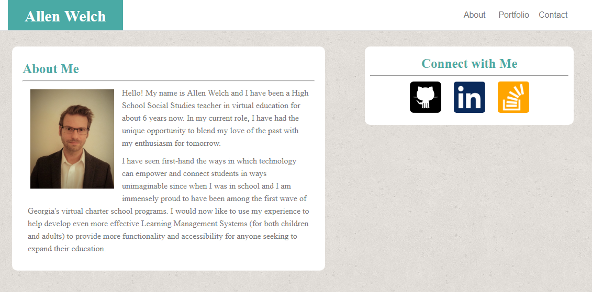

# Responsive-Portfolio
wk2 HW Assignment 2
 
https://allenjwelch.github.io/Responsive-Portfolio/

<!--Use three @media screen tags, each with one of these max-widths: 980px, 768px and 640px.
You use 980px because you never want any of the content to be cut off. Since the desktop layout is about 960px wide, you want the media queries to kick in before your content gets cut off.-->

<!--768px is about the width of a tablet and 640px is about the width of a phone in landscape.-->
